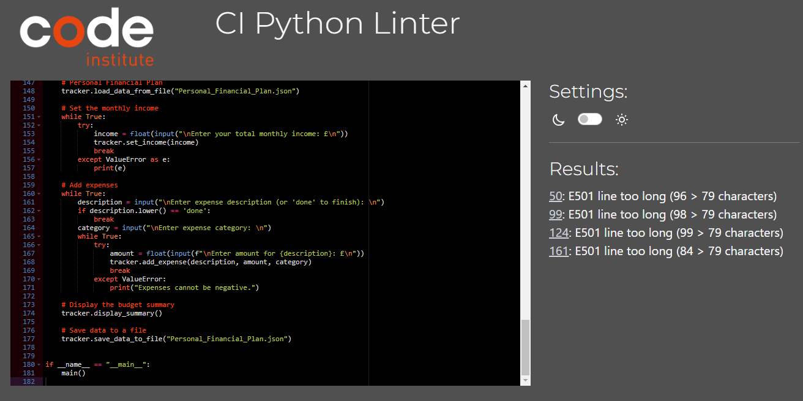

# Personal Financial Plan

Personal Financial Plan is a Python terminal application that runs on the Code Institute mock terminal on Heroku.

It is an organized strategy to manage your funds on a monthly basis. Individuals who consistently adhere to a personal monthly financial plan can gain control of their finances, achieve their financial goals, and strive toward long-term financial security and independence.

Here is the live version of my project.

## Conception

- My initial step was to draw a flow diagram of my scope for the Personal Financial Plan concept.

- The Personal Financial Plan lets users keep track of their monthly income and expenses. It allows you to imput revenue, add expenses with description and categories, view a budget summary, and store the data to a file for reference.

## Setup of Gitpod Workspace and resources

I made use of Code Institutes "Love Sandwiches Walkthrough Project", "Getting Set Up" course videos for the following:
 - [Creating a Google Sheet](https://youtu.be/4MWpwuPpSCA).
 - [To activate API credentials](https://youtu.be/WTll5p4N7hE).
 - [Setup of Gitpod Workspace](https://youtu.be/3ikrLWM0QqU).
 - [Connecting to the API with Python](https://youtu.be/lPTKUiafTRY).

## Features

### Existing Features

- When initializing the program, the user is dispalyed a welcome message.

- Set Income - allows user to input monthly income, enabling proper financial tracking and budget management. Users enter their income amount.

- Entered income amount will automatically appear and saved in the Personal Financial Plan Google worksheet.

- Whenever a negative income amount is entered, the user will be promted that "Income cannot be negative"

- Add Expense Description - allows user to describe expenses in details.

- Add Category - enable user to categorize expenses based on the nature of usage.

- Add Amount - user will define how much is spent on this category for the month.

- Whenever a negative expense amount is entered, the user will be promted that "Expenses cannot be negative"

- After the user is satisfied entering all the expenses needed to be considered, user will enter 'done' to finish the process. Then a summary of Monthly Personal Finances will be printed in the screen.

- When all data is entered, subsequently all data entered will be saved in the Personal Financial Plan Google Spreadsheet.

### Future Features

- Expand the code and incorporate the budgeted monthly income and expenses versus the actual monthly income and expenses.
- Allow historical data to be retrived and new data stored for further future references.

## Testing

- Tested data_validator function with various data types and amounts of data provided:
    - If the income amount is in negative value - ValueError is raised as intended.
    - If the income amount is not valid - it will not be recorded/saved in the worksheet.
    - If the expenses amount is in negative value - ValueError is raised as intended.
    - If the expenses amount is in negative value - user will be promted to inter valid value.

- Tested if program is updating the Google worksheet correctly - Working as intended.
- I also made use of the Python type method in order to check types of data returned where needed.

### Final Validator test

- Final validation returns four (4) E501 line too long errors.
    - Code description and structure are too long that it strikes the limit of 79 characters.
    - Ask my mentor and said it will not post a major issue so I let it as is.

### Unfixed Bugs

- No bugs left unfixed.

## Deployment

- This application is deployed on [Heroku](https://id.heroku.com/login) as described by Code Institute in the Love Sandwiches walkthrough project [deployment video Part 1](https://youtu.be/BhW26FryaYI) and [deployment video Part 2](https://youtu.be/ONx3iEqAOM4) with additional instruction concerning the update of the Heroku app. These were the neccessary steps in the order that they need to be done:

  1. Firstly I added a new line character (\n) to the end of the text of any input methods due to a software issue as describe in the tutorial, in order to display the input method's text in the terminal as intended.
  2. I create a list of requirements as described in the tutorial in order for the program to run as intended, Heroku will need these dependencies in order to run the application on the deployed site.
  3. I opened Heroku and on the dashboard page click on the "NEW" button and select the "Create a new app" option.
  4. On the new page that opens, I named my app, selected my region and then clicked on the "Create app" button.
  5. On the new page select the settings tab.
  6. On the new page, in the config vars section, I selected the "Reveal Config Vars" button.
  7. Next I selected the "Key" input field and typed in "CREDS" as the key.
  8. I then copied my creds.json file content and pasted that into the "Value" input area, and clicked the "Add" button.
  9. Next I added the word "PORT" as another "Key" with "8000" as the "Value" and again clicked on the "Add" button.
  10. I then selected the "Add buildpack" button, then first selected the "Python" option and saved the changes.
  11. I repeated the previous step but this time selected the node.js option and saved this buildpack change.
  12. I then selected the "Deploy" tab on the top of the page.
  13. I then selected "Github" as my deployment method and clicked on the "Connect to Github" button.
  14. Next I searched for this app's repository in the "Connect to Github" section of the page and clicked on connect on order to connect the repository to this application.
  15. Next I clicked on the "Deploy Branch" button in the "manual Deploy" section of the page.
  16. Once the app was built, I selected the "View" button under the now visible "Your app was successfully deployed" message in order to view the page of the now running application.
  17. After previewing the running application I went back to the previous page and toggled the "Enable Automatic Deploys" button so that the app would automatically update when a change is pushed to Github.

Here is the live link [Personal Financial Plan](https://personal-monthly-financial-008cfb3b6e6c.herokuapp.com/)