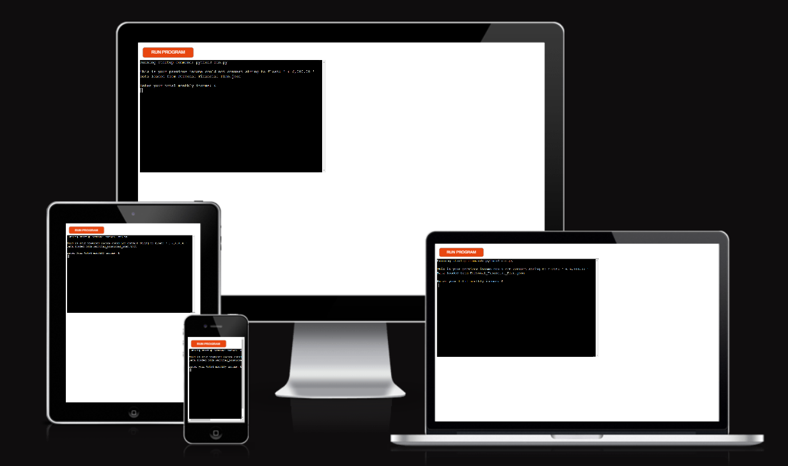
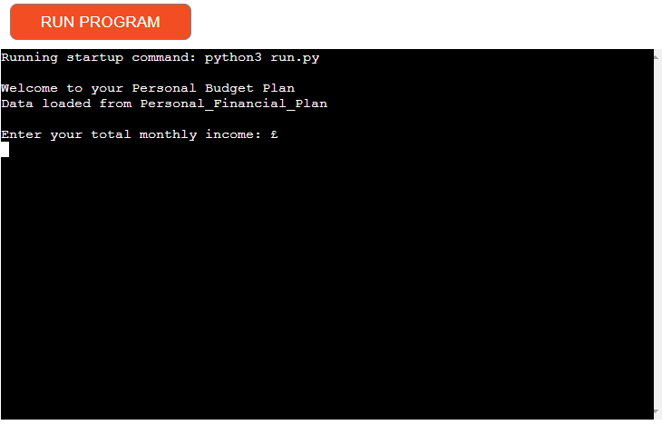

# Personal Financial Plan

Personal Financial Plan is a Python terminal application that runs on the Code Institute mock terminal on Heroku.

It is an organized strategy to manage your funds on a monthly basis. Individuals who consistently adhere to a personal monthly financial plan can gain control of their finances, achieve their financial goals, and strive toward long-term financial security and independence.

Here is the live version of my project.

## Conception

- My initial step was to draw a flow diagram of my scope for the Personal Financial Plan concept.

- The Personal Financial Plan lets users keep track of their monthly income and expenses. It allows you to imput revenue, add expenses with description and categories, view a budget summary, and store the data to a file for reference.

## Setup of Gitpod Workspace and resources

I made use of Code Institutes "Love Sandwiches Walkthrough Project", "Getting Set Up" course videos for the following:
 - [Creating a Google Sheet](https://youtu.be/4MWpwuPpSCA).
 - [To activate API credentials](https://youtu.be/WTll5p4N7hE).
 - [Setup of Gitpod Workspace](https://youtu.be/3ikrLWM0QqU).
 - [Connecting to the API with Python](https://youtu.be/lPTKUiafTRY).

## Features

### Existing Features

- When initializing the program, the user is dispalyed a welcome message.

- Set Income - allows user to input monthly income, enabling proper financial tracking and budget management. Users enter their income amount.

- Entered income amount will automatically appear and saved in the Personal Financial Plan Google worksheet.

- Whenever a negative income amount is entered, the user will be promted that "Income cannot be negative"

- Add Expense Description - allows user to describe expenses in details.

- Add Category - enable user to categorize expenses based on the nature of usage.

- Add Amount - user will define how much is spent on this category for the month.

- Whenever a negative expense amount is entered, the user will be promted that "Expenses cannot be negative"

- After the user is satisfied entering all the expenses needed to be considered, user will enter 'done' to finish the process. Then a summary of Monthly Personal Finances will be printed in the screen.

- When all data is entered, subsequently all data entered will be saved in the Personal Financial Plan Google Spreadsheet.

### Future Features

- Expand the code and incorporate the budgeted monthly income and expenses versus the actual monthly income and expenses.
- Allow historical data to be retrived and new data stored for further future references.

## Testing

- 